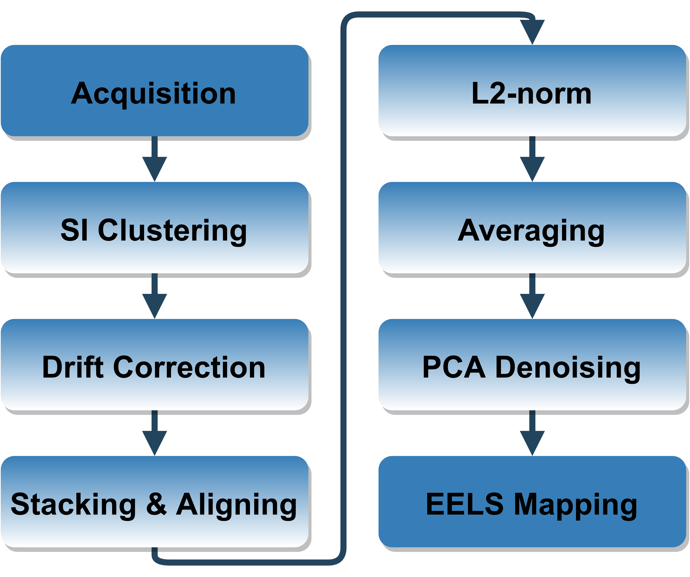
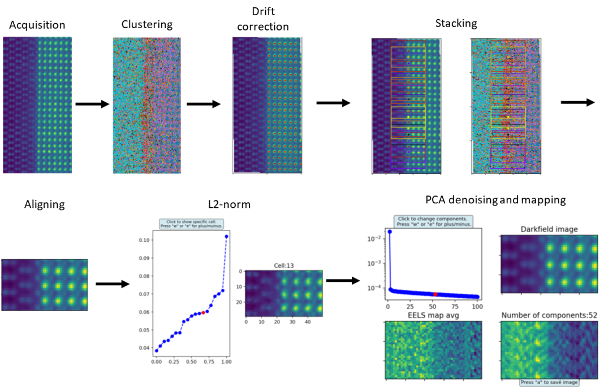

# Post-processing of STEM-EELS spectrum images for core-loss fine structure mapping

This is a step-by-step jupyter notebook for post-processing EELS spectrum images with corresponding reference image according to the paper:

The aim of the script is a fast and easy processing procedure by multi-frame averaging including automatic control mechanisms assessing data quality, with the goal to map individual electronic states by STEM-EELS in a routine way.

|  | 
|:--:| 
| *Post-Processing Path* |

As an example the fine structure mapping of LAO-Anatase interface is shown.

|  | 
|:--:| 
| *Post-Processing Path* |

If you use this script please cite:
